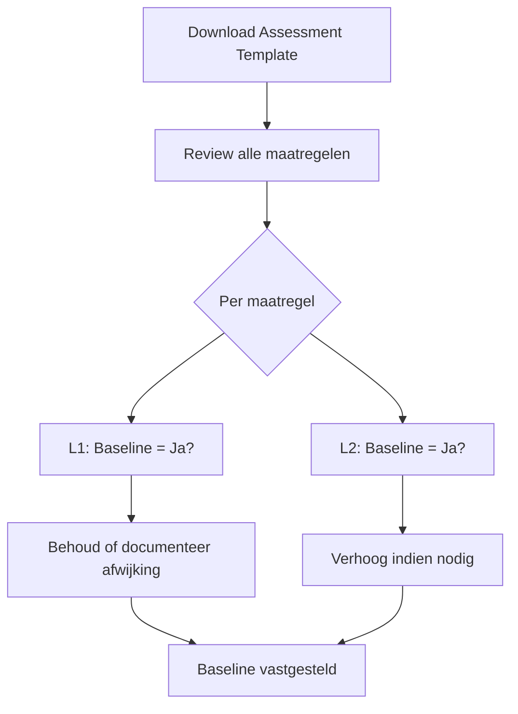
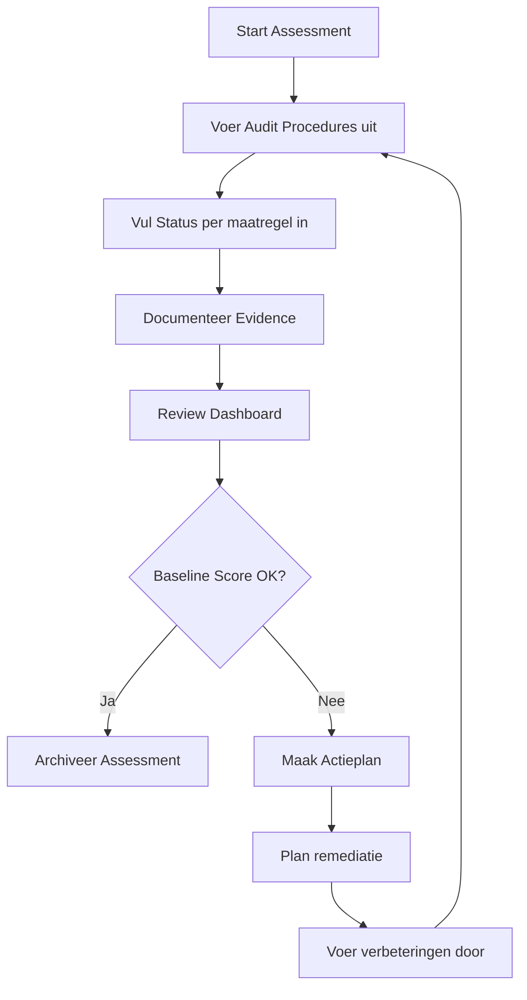

# 📐 Benchmark en Baseline Systematiek

> Dit document beschrijft de systematiek van Benchmarks, Maatregelen, Levels en Baseline binnen het SCF-Vault Security Control Framework.

---

## Navigatie

| ← Terug | Omhoog | Gerelateerd |
|---------|--------|-------------|
| [[Documentatie/_index\|📖 Documentatie]] | [[README\|🏠 Home]] | [[Benchmarks/_index\|📏 Benchmarks]] · [[Assessments/_index\|📝 Assessments]] |

---

## 1. Begrippenkader

### 1.1 Hiërarchie

```
Framework (ISO 27001, NIS2, BIO2)
    ↓
CIS Controls (18 categorieën, 153 controls)
    ↓
Benchmarks (per technologie/component)
    ↓
Maatregelen (concrete, auditeerbare acties)
```

### 1.2 Definities

| Term | Definitie |
|------|-----------|
| **Benchmark** | Een verzameling security maatregelen voor een specifieke technologie of component, gebaseerd op best practices en/of officiële CIS Benchmarks |
| **Maatregel** | Een concrete, auditeerbare security configuratie of actie binnen een Benchmark |
| **Level** | CIS-standaard classificatie (L1/L2) die de diepgang van beveiliging aangeeft |
| **Baseline** | Organisatie-specifieke markering welke maatregelen verplicht zijn |

---

## 2. CIS Benchmark Levels

De Level-indeling is de **officiële CIS Benchmark standaard** die wereldwijd wordt gehanteerd.

### 2.1 Level 1 (L1) — Basis Beveiliging

> "Practical security settings that can be implemented without significant performance impact"

**Kenmerken:**
- Minimale impact op functionaliteit en bruikbaarheid
- Geschikt voor alle productieomgevingen
- Vormt de basis voor elke security hardening
- Beperkt de meest voorkomende aanvalsvectoren

**Voorbeelden:**
- Default wachtwoorden wijzigen
- TLS/HTTPS afdwingen
- Audit logging inschakelen
- Ongebruikte services uitschakelen

### 2.2 Level 2 (L2) — Verhoogde Beveiliging

> "Defense in depth settings that may reduce functionality"

**Kenmerken:**
- Kan functionaliteit of performance beïnvloeden
- Vereist meer configuratie-inspanning
- Aanbevolen voor hoog-risico of kritieke systemen
- Biedt extra beschermingslagen

**Voorbeelden:**
- Mutual TLS (client certificaten)
- Externe authenticatie backend (LDAP/OAuth)
- Read-only filesystems
- Strikte network segmentatie

### 2.3 Relatie tot BBN (Baseline Beveiliging Nederlandse Overheid)

| BBN Niveau | Typische Level Vereiste |
|------------|------------------------|
| BBN1 | Selectie van L1 maatregelen |
| BBN2 | Alle L1 maatregelen + selectie L2 |
| BBN3 | Alle L1 + L2 maatregelen + aanvullend |

Voor XENA (BBN2-classificatie) geldt: **alle L1 maatregelen zijn verplicht**.

---

## 3. Baseline Systematiek

### 3.1 Waarom een aparte Baseline?

De CIS Levels zijn een **generieke, wereldwijde standaard**. Elke organisatie heeft echter eigen:
- Risicoprofiel en dreigingslandschap
- Technische architectuur en beperkingen
- Compliance-eisen (NIS2, BIO, AVG)
- Beschikbare resources en prioriteiten

De **Baseline** kolom maakt het mogelijk om de CIS-standaard te **contextualiseren** voor de eigen organisatie.

### 3.2 Baseline Berekening (Overerving van CIS Controls)

De Baseline wordt **automatisch berekend** op basis van twee factoren:

```
Baseline = (Level == L1) AND (Minstens één gekoppelde CIS Control is baseline)
```

#### Beslislogica:

| Maatregel Level | CIS Control(s) Baseline | Resultaat Baseline |
|-----------------|------------------------|-------------------|
| L1 | Minstens één = Ja | **Ja** |
| L1 | Alle = Nee | Nee |
| L2 | (niet relevant) | **Nee** |

#### Voorbeeld RabbitMQ:

| Maatregel | Level | Gekoppelde CIS Controls | CIS Baseline? | Berekende Baseline |
|-----------|-------|------------------------|---------------|-------------------|
| RMQ-1.1 Guest account | L1 | CIS-5.1, CIS-5.4 | Ja, Ja | **Ja** |
| RMQ-1.3 LDAP backend | L2 | CIS-5.6, CIS-6.7 | Ja, Ja | **Nee** (L2) |
| RMQ-7.1 Message TTL | L1 | CIS-3.4, CIS-4.1 | Nee, Ja | **Ja** (4.1 is baseline) |

### 3.3 CIS Control Baseline Status

De baseline status van CIS Controls is vastgelegd in de SCF-Vault en gebaseerd op:
- CIS Implementation Group 1 (IG1) = Baseline
- BBN2 vereisten
- Organisatie-specifieke risicoanalyse

Van de 153 CIS sub-controls zijn er **~120 als baseline** gemarkeerd.

### 3.4 Aanpassingsmogelijkheden

De berekende baseline is een **startpunt**. Organisaties kunnen afwijken:

#### Scenario A: L2 → Baseline Ja (Verhogen)

Een organisatie kan een L2 maatregel naar Baseline verheffen wanneer:
- Het systeem kritieke gegevens verwerkt
- Specifieke compliance-eisen dit vereisen
- Het risicoprofiel dit rechtvaardigt

**Voorbeeld:**
```
RMQ-1.3 "LDAP authentication backend" (L2)
→ Baseline: Ja
→ Reden: Gemeentelijk beleid vereist centraal identiteitsbeheer
```

#### Scenario B: L1 → Baseline Nee (Verlagen)

Een organisatie kan een L1 maatregel van Baseline uitsluiten wanneer:
- De maatregel technisch niet toepasbaar is
- Een compenserende maatregel bestaat
- Het risico formeel is geaccepteerd

**Dit vereist altijd:**
1. Formele risicoanalyse
2. Documentatie van compenserende maatregelen
3. Goedkeuring door CISO/security officer
4. Periodieke heroverweging

**Voorbeeld:**
```
RMQ-3.2 "Disable non-TLS listeners" (L1)
→ Baseline: Nee
→ Reden: Legacy applicatie X kan geen TLS. Compensatie: network segmentatie + 
         firewall rules. Geaccepteerd risico tot migratie Q3 2026.
```

### 3.4 Comply-or-Explain Principe

Voor elke afwijking van de default Baseline geldt het **comply-or-explain** principe:

| Afwijking | Vereiste Documentatie |
|-----------|----------------------|
| L2 → Baseline Ja | Onderbouwing waarom verhoging nodig is |
| L1 → Baseline Nee | Risicoanalyse + compenserende maatregelen + goedkeuring |

---

## 4. Assessment Systematiek

### 4.1 Kolommen in Assessment Templates

| Kolom | Beschrijving | Aanpasbaar? |
|-------|--------------|-------------|
| **ID** | Unieke maatregel identifier | Nee |
| **Level** | CIS Level (L1/L2) | Nee (standaard) |
| **Baseline** | Verplicht voor organisatie (Ja/Nee) | **Ja** |
| **CIS Controls** | Gekoppelde CIS sub-controls | Nee |
| **Control Title** | Korte naam | Nee |
| **Control Description** | Uitgebreide beschrijving | Nee |
| **Audit Procedure** | Hoe te controleren | Nee |
| **Expected Config** | Verwachte configuratie | Nee |
| **Status** | Huidige implementatiestatus | **Ja** |
| **Evidence Location** | Bewijs referentie | **Ja** |
| **Comments** | Opmerkingen | **Ja** |
| **Responsible Party** | Verantwoordelijke | **Ja** |

De **CIS Controls** kolom toont welke CIS sub-controls (bijv. CIS-5.1, CIS-3.10) aan de maatregel zijn gekoppeld. Dit maakt de herkomst van de baseline-berekening inzichtelijk.

### 4.2 Status Waarden

| Status | Betekenis | Telt mee voor score? |
|--------|-----------|---------------------|
| **Compliant** | Volledig geïmplementeerd en geverifieerd | Ja (positief) |
| **Partial** | Gedeeltelijk geïmplementeerd | Ja (negatief) |
| **Non-Compliant** | Niet geïmplementeerd | Ja (negatief) |
| **N/A** | Niet van toepassing | Nee (uitgesloten) |

### 4.3 Dashboard Metrics

Het Summary Dashboard toont twee compliance scores:

| Metric | Formule | Betekenis |
|--------|---------|-----------|
| **Totaal Score %** | Compliant / (Compliant + Partial + Non-Compliant) × 100 | Algehele compliance |
| **Baseline Score %** | Baseline Compliant / (Baseline Compliant + Partial + Non-Compliant) × 100 | Compliance op verplichte maatregelen |

De **Baseline Score** is de primaire KPI voor compliance rapportage.

---

## 5. Workflow

### 5.1 Initiële Setup (eenmalig per organisatie)



### 5.2 Periodieke Assessment



### 5.3 Assessmentfrequentie

| Systeemtype | Aanbevolen Frequentie |
|-------------|----------------------|
| Kritieke systemen (BBN3) | Kwartaal |
| Standaard productie (BBN2) | Halfjaar |
| Ondersteunend (BBN1) | Jaarlijks |
| Na significante wijzigingen | Direct |

---

## 6. Relatie met CIS Controls

### 6.1 Mapping

Elke Benchmark-maatregel is gekoppeld aan één of meer CIS Controls:

```
Benchmark Maatregel          →  CIS Control(s)
─────────────────────────────────────────────
RMQ-1.1 Guest account        →  CIS-5 Account Management
RMQ-3.1 TLS enabled          →  CIS-3 Data Protection
ALF-2.3 LDAP integratie      →  CIS-5, CIS-6
```

### 6.2 Dubbele Baseline Check

Een maatregel kan alleen Baseline zijn als de **gekoppelde CIS Control** ook Baseline is op framework-niveau:

| CIS Control Baseline | Maatregel Level | Maatregel Baseline mogelijk? |
|---------------------|-----------------|------------------------------|
| Ja | L1 | Ja (default) |
| Ja | L2 | Ja (verhoogd) |
| Nee | L1 | Ja, maar niet verplicht via framework |
| Nee | L2 | Alleen indien organisatie-specifiek vereist |

---

## 7. Best Practices

### 7.1 Bij het vaststellen van Baseline

✅ **Doe:**
- Begin met de defaults (L1 = Baseline Ja)
- Documenteer elke afwijking
- Betrek stakeholders (beheerders, architects, security)
- Review jaarlijks of bij architectuurwijzigingen

❌ **Vermijd:**
- Alle L2 maatregelen uitsluiten zonder overweging
- L1 maatregelen uitsluiten zonder compensatie
- Baseline vaststellen zonder technische validatie

### 7.2 Bij het uitvoeren van Assessments

✅ **Doe:**
- Gebruik de Audit Procedures letterlijk
- Documenteer evidence met timestamps
- Bij twijfel: markeer als Partial, niet Compliant
- Betrek de verantwoordelijke beheerder

❌ **Vermijd:**
- Self-assessment zonder verificatie
- Evidence alleen op basis van documentatie (test daadwerkelijk)
- N/A gebruiken om lage scores te maskeren

---

## 8. Gerelateerde Documenten

- [[Benchmarks/_index|📏 Benchmarks Overzicht]]
- [[Benchmarks/EXT/_index|📙 Extended Benchmarks]]
- [[Assessments/_index|📝 Self-Assessments]]
- [[Controls/CIS/_index|📋 CIS Controls]]
- [[Documentatie/Systeem Onboarding Procedure|Systeem Onboarding]]

---

## Wijzigingshistorie

| Versie | Datum | Auteur | Wijzigingen |
|--------|-------|--------|-------------|
| 1.0 | 2026-02-11 | CISO | Initiële versie |
